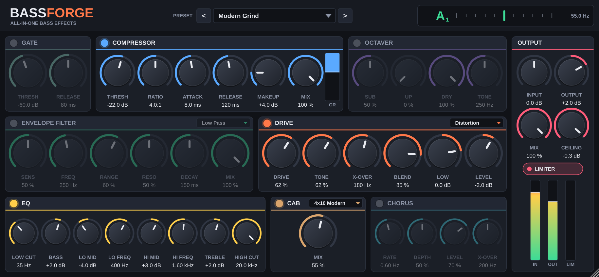

# BassForge

An all-in-one bass effects plug-in for Ableton Live 12 (VST3 and Audio Unit on
macOS, VST3 on Windows, plus a standalone app). One device on your bass track
replaces a pedalboard, a preamp and a cab.



## Signal chain

```
Input → Gate → Compressor → Octaver → Envelope Filter → Drive → EQ → Cab → Chorus → Mix → Output → Limiter
```

Every module has its own power switch. Switching one on or off crossfades over
15 ms, so you can automate the switches in Live without clicks.

| Module | What it does | Controls |
| --- | --- | --- |
| **Gate** | Stereo-linked noise gate with hysteresis and hold. Silences pickup hum and string noise between notes without choking sustain. | Thresh, Release |
| **Compressor** | Soft-knee feed-forward compressor with a parallel mix for New York-style compression. The GR meter shows gain reduction. | Thresh, Ratio, Attack, Release, Makeup, Mix |
| **Octaver** | Analog-style octave pedal (think OC-2). A flip-flop sub an octave down that follows your dynamics, plus an octave-up voice. It is monophonic, like the hardware, so play single notes. | Sub, Up, Dry, Tone |
| **Envelope Filter** | Auto-wah / Mu-Tron-style filter swept by your playing. Low-pass, band-pass or high-pass. | Mode, Sens, Freq, Range, Reso, Decay, Mix |
| **Drive** | Splits the signal at the X-Over frequency and distorts only the upper band, so the low end stays tight and in tune, like a modern bass preamp. Five voicings: Tube, Overdrive, Distortion, Fuzz and Fold (wavefolder). Runs at 4x oversampling with antiderivative anti-aliasing. | Type, Drive, Tone, X-Over, Blend, Low, Level |
| **EQ** | Bass-amp EQ: low cut, bass shelf (90 Hz), two sweepable mids, treble shelf (4 kHz) and high cut. | Low Cut, Bass, Lo Mid, Lo Freq, Hi Mid, Hi Freq, Treble, High Cut |
| **Cab** | Speaker cabinet simulation, blendable against the DI the way engineers mix a DI and a mic. | 1x15 Vintage, 4x10 Modern, 8x10 Classic, 2x12 Tight; Mix |
| **Chorus** | Bass chorus that only modulates above its X-Over, so the low end stays centred and mono-safe. On a stereo track it widens the sound, even from a mono input. | Rate, Depth, Level, X-Over |
| **Output** | Input and output gain, global dry/wet mix, and a look-ahead brickwall limiter. The limiter never lets the output go above its Ceiling. | Input, Output, Mix, Ceiling, Limiter |

The header also has a **chromatic tuner**. It reads 25–500 Hz, which covers
5- and 6-string basses, and the needle turns green within ±3 cents.

### Factory presets

Pick a preset from the menu at the top of the plug-in, or step through them
with `<` and `>`. All of them are level-matched, so the loudest preset doesn't
win the comparison.

Clean DI · Motown Warm · Modern Grind · Synth Funk · Fuzz Sub · Slap Bright ·
Dub Deep · Fretless Chorus · Octave Pop · Rock Pick · Fold Synth ·
Octave Up Fuzz · Doom · Reggae Round · Gated Wah Funk

To save your own sounds, use Live's own preset saving: the save icon in the
device title bar stores every knob in your User Library.

### Using the controls

- Drag a knob up or down. The mouse wheel works too.
- Double-click a knob to reset it to its default value.
- Double-click a value readout to type an exact number, such as `250 Hz` or `-6`.
- Drag the bottom-right corner to resize the window.
- All 53 parameters can be automated and MIDI-mapped in Live.

## Installing in Ableton Live 12

### Option 1: download a build (no compiler needed)

Every push to `BassForge/` builds the plug-in on GitHub Actions. Open the
repository's **Actions** tab, choose the latest green **BassForge plug-in**
run, and download `BassForge-macOS` or `BassForge-Windows` from
**Artifacts**.

**macOS**

1. Unzip the files and move them into place:
   - `BassForge.vst3` → `~/Library/Audio/Plug-Ins/VST3/`
   - `BassForge.component` → `~/Library/Audio/Plug-Ins/Components/`
2. These builds aren't notarised by Apple, so macOS quarantines the
   downloaded files. Unblock them once in Terminal:
   ```sh
   xattr -dr com.apple.quarantine ~/Library/Audio/Plug-Ins/VST3/BassForge.vst3
   xattr -dr com.apple.quarantine ~/Library/Audio/Plug-Ins/Components/BassForge.component
   ```
3. In Live, open **Settings → Plug-Ins**. Turn on **Use Audio Units v2**
   and/or **Use VST3 Plug-in System Folders**, then click **Rescan**.

**Windows**

1. Unzip and copy `BassForge.vst3` to `C:\Program Files\Common Files\VST3\`.
2. In Live, open **Settings → Plug-Ins**, turn on **Use VST3 Plug-in System
   Folders**, then click **Rescan**.

BassForge then appears in Live's browser under **Plug-Ins → The Music Box**.
Drag it onto an audio track that has your bass on it.

### Option 2: build from source

You need CMake 3.22 or newer, plus Xcode on macOS or Visual Studio 2022 (with
"Desktop development with C++") on Windows. JUCE 9.0.3 is downloaded
automatically the first time you configure.

```sh
cd BassForge
cmake -B build -DCMAKE_BUILD_TYPE=Release
cmake --build build --config Release --parallel
```

On macOS this builds universal (Apple Silicon + Intel) binaries. It also
copies the VST3 and AU straight into `~/Library/Audio/Plug-Ins`, so you only
need to rescan in Live. On Windows, either copy the VST3 from
`build/BassForge_artefacts/Release/VST3/` yourself, or configure from an
administrator prompt with `-DBASSFORGE_COPY_AFTER_BUILD=ON`.

To build one format only, add `--target BassForge_VST3`, `BassForge_AU` or
`BassForge_Standalone`.

## Latency

BassForge reports a fixed latency of about 2.25 ms at 48 kHz: 4x oversampling
for the drive plus a 1 ms limiter look-ahead. The latency stays the same
whichever modules are on, and Live compensates for it automatically. If you
monitor yourself through Live while recording, Live's **Options → Reduced
Latency When Monitoring** keeps it tight.

## Tests

The `BassForgeTests` target is a headless test runner. It checks:

- latency reporting and null tests at 44.1–192 kHz
- that every module behaves as described: compressor gain reduction, gate
  attenuation, octave pitch, filter sweep, drive harmonics and aliasing, EQ
  gain, the limiter ceiling, and chorus stereo width with mono lows
- that switching modules on and off doesn't click
- that every factory preset is level-matched and stays below the ceiling
- state save/restore, including corrupt state
- tuner accuracy from low B up to G4
- stress runs with every module on at extreme settings, at block sizes from 1
  to 2048 samples
- CPU usage

It also renders the editor to PNG files.

```sh
cmake --build build --target BassForgeTests
ctest --test-dir build -C Release --output-on-failure
```

## Project layout

```
BassForge/
  CMakeLists.txt         build definition (fetches JUCE)
  Source/
    PluginProcessor.*    the signal chain, parameter smoothing, latency, state
    PluginEditor.*       the window and its layout
    Parameters.*         all parameter IDs, ranges and text formatting
    Presets.*            factory presets
    dsp/                 one header per effect (no JUCE GUI dependencies)
    gui/                 look-and-feel, knobs, sections, meters, tuner
  tests/                 headless test runner
```

Parameter IDs are saved inside Live sets. Never rename one that has shipped;
add a new one instead.
